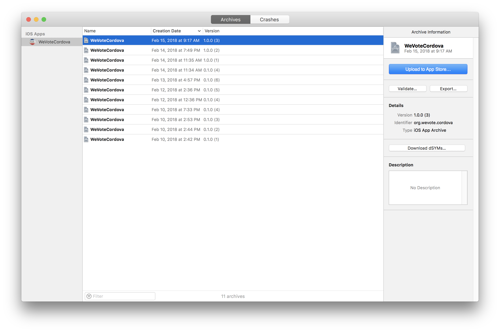
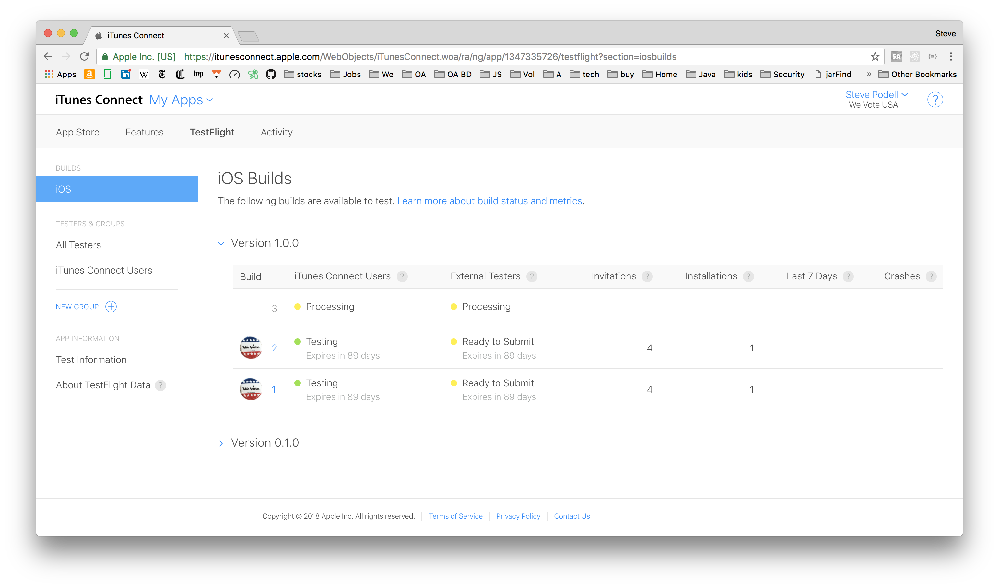

## Making an iOS release

1. After testing,and making your React changes in the WebApp, check in those changes and prepare (ideally) to build from a fully 
up-to-date WebApp develop.

1. Your WebApp config.js, should look like this:
    ```
    module.exports = {
      WE_VOTE_URL_PROTOCOL: "https://",  // "http://" for local dev or "https://" for live server
      WE_VOTE_HOSTNAME: ""WeVote.US",  // This should be without "http...". This is "WeVote.US" on live server.
    
      WE_VOTE_SERVER_ROOT_URL: "https://api.wevoteusa.org/",
      WE_VOTE_SERVER_ADMIN_ROOT_URL: "https://api.wevoteusa.org/admin/",
      WE_VOTE_SERVER_API_ROOT_URL: "https://api.wevoteusa.org/apis/v1/",
    
      DEBUG_MODE: false,
    
      // Use 1 or 0 as opposed to true or false
      test: {
        use_test_election: 0,
      },
    
      location: {
        text_for_map_search: "",
      },
    
      FACEBOOK_APP_ID: "<the actual number that you got from Dale>",
    
      STRIPE_API_KEY: "<the production 'pk_live_...' api key from Dale.  NOT the test 'pk_test_...'>",
    
      IS_CORDOVA: false,
    };
    ```

    That `IS_CORDOVA` value has been abandoned, and does not need to be changed.
    
    Be sure to double check that you are using these production config values, it
    would be difficult (but possible) to detect a misconfiguration while testing.

1. Run a gulp task, or otherwise build the WebApp `bundle.js`

2. On WeVoteCordova side,on the Target General Properties tab, increment the 
build number by one.  For example build 3, becomes Build 4.

    
    
    This may be the only change that gets made in the WeVoteCordova repository,
    but it is important to check it in so that we have a record of how each build was
    made.  When you do check it it, please include a reference to the WebApp
    Git commit that resulted in the `bundle.js`

3. Before checking in WeVoteCordova, test on a simulator for both an iPhone and iPad.

4. Build a release candidate in Xcode 

   * You will need a physical iPhone plugged into your computer via a USB cable (It is possible that an iPad or iPod touch would work for this purpose.)
   * The phone will have to be registered with Apple inorder for Xcode to sign the app.
   * Then build the release candidate in Xcode via Product/Archive
   * Then follow the options to upload the candidate to "the App Store" via [https://itunesconnect.apple.com/](https://itunesconnect.apple.com/)  Dale can make you
an account on itunesconnect

      * Allow "Upload your app's symbols...
      * Automatically manage signing
      * Upload
      

   * After upload, it could take a half hour for the build to appear on itunes connect, and then
the build could be "Processing" for another half hour.  (Due to an ancient Apple WebObjects
page, refreshing the page could make the "processing" build disappear, but it
is still processing, and will reappear when done.  And sadly, the WebObjects page does not update itself when
done, so you will have to refresh to confirm that it is done processing, and probably shows "Missing Compliance"
as its status.)

    
    iTunes Connect Processing

5.  Wait for the build to appear
When processing is done, the build will be in the "Missing Compliance" state, clikc on the build number link, 
to "Provide Export Compliance Information"  Click on the "Provide Export Compliance Information" button

   * Have you added or made changes to encryption features since your last submission of this app? **NO**
   * Proceed to "Start Internal Testing"

6. Test in TestFlight
    After compliance is done, and you have proceeded to internal testing, it take can a minute to an hour for the app build
    to be available on the "iOS Builds" list in TestFlight.  Then a minute to an hour for the app to be available to test
    on your iPhone via the TestFlight app.

      

7. Finally submit for review in iTunesConnect
    Submit it for TestFlight
    
    Test it on TestFlight (the app might rejected if Apple does not see any
    evidence of testing, ideally by multiple users).

8.  Once testing is complete, submit it for "Review"


**[Return to the WeVoteCordova home documentation page ](/README.md)**

**[On to the Making an Android Release page](docs/MakingAnAndroidRelease.md)**